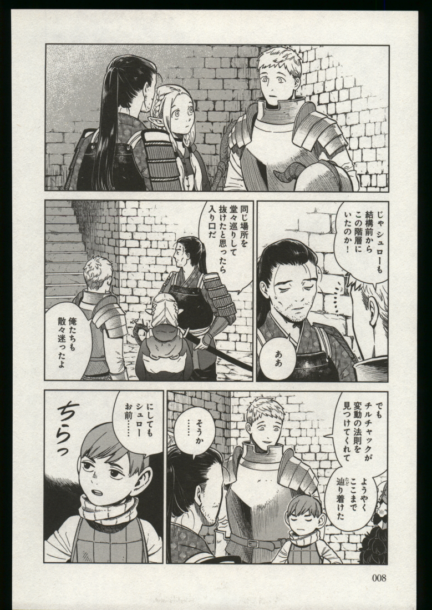

# はじめに
今年のクリスマスは友達との忘年会の予定が既に入っている黒河です。  

先日、某Grリーダからこんな会話をされました  
・Grリーダ氏「ちょっとこれ作ってみてよ [画像処理で自炊書籍画像を読みやすく加工する 初級編](https://qiita.com/suzuna-honda/items/32920191f775cb2f26bf#:~:text=Organization-,%E7%94%BB%E5%83%8F%E5%87%A6%E7%90%86%E3%81%A7%E8%87%AA%E7%82%8A%E6%9B%B8%E7%B1%8D%E7%94%BB%E5%83%8F%E3%82%92%E8%AA%AD%E3%81%BF%E3%82%84%E3%81%99%E3%81%8F%E5%8A%A0%E5%B7%A5%E3%81%99%E3%82%8B%20%E5%88%9D%E7%B4%9A%E7%B7%A8,-iOS)」  

雑談をしているとさらっと自分で使う便利ツールを作らせようとしてくるGrリーダ氏。  
どうやら今回は本の自炊で使う便利ツールが欲しいみたいです。  

いつもは実際に取り組むことは無いのですがアドベントカレンダーのネタになるかもと思い取り組んで見ることに。  
ということで、今回は書籍の自炊用にスキャンした画像読みやすく加工してみようという内容になります。  

(記事元にソースコードが全く無かったのと画像処理について知見が少なかったのでまぁまぁしんどかった)

# 今回使用するデータ  
早速テスト用に使用するデータを用意しようと思ったのですが自分は自炊をしないのでデータがありません。  
というわけで参考元のURLで使用されていた以下の画像を使用していきたいと思います。
  

このままでも読めなくはないですがどうしてもスキャンしたままなので読みづらいです。  
今回はこの画像を加工していってどこまで電子書籍の画像っぽくなるのかチャレンジしていきます。  

# 明るさの調整
まずは明るさの調整からです。  
画像を見た感じ白色と黒色がかなり浮いているように見えるので一度ヒストグラムを確認してみます。

## ヒストグラムの確認  
初めにグレースケールで画像を読み込みます(今回はカラー画像について考えずにすべてグレースケールで扱います)
```python
import cv2

img = cv2.imread("画像のパス")
gray = cv2.cvtColor(img, cv2.COLOR_RGB2GRAY)
```
読み込んだ画像が以下です。  


ヒストグラムを作成するためのプログラムが以下です  
```python
import cv2
import matplotlib.pyplot as plt

def calc_histgram(img,is_save=False ,graph_name="histgram.png"):
    """
    入力された画像のヒストグラムを作成する
    input:
        img: ヒストグラムを作成する元になる画像データ
        is_save: Trueならヒストグラムの結果を画像として保存する
        graph_name: ヒストグラムを画像として保存するときの名前
    """

    img_hist = cv2.calcHist([img], [0], None, [256], [0, 256])

    # ヒストグラムを画像として保存する
    if is_save:
        plt.plot(img_hist)
        plt.savefig(graph_name)

    return img_hist

```
で、出力されたヒストグラムが以下です。


実際にヒストグラムをみてみるとたしかに255(白色)と0(黒色)に値がなく少し浮いていますね。  
しっかりと白・黒の色を出そうとするとこれを両端にしっかりとつけてあげる必要があります。    
というわけでコントラストと明るさを調整してまずは色を作ってきましょう。  

## コントラストの調整について
ところで、意気揚々と調整だ！と思っていたところコントラスト調整の理論的なところが分からずことに気づきました。    
もともと一眼レフを触っていたこともあって感覚的には調整できるのですが理論的な箇所が全くだったので少し調べて見ました。  

参考サイト：[OpenCV – 画像の明るさ、コントラストの変更、ガンマ補正
](https://pystyle.info/opencv-change-contrast-and-brightness/)

このサイトを見るとコントラストと明るさは以下の式で調整できるようです。  
```math
dst(x,y) = α * src(x,y) + β
```

dst(x,y): x, yの位置にある調整後の画素値  
src(x,y): x, yの位置にある画素値   
α: ゲイン値  
β: 明るさバイアス

これを見るとシンプルに線形変換をしているだけのようですね。  
感覚的にはゲイン値を上げると色の変化が激しくなり、明るさバイアスを上げると全体的に白寄りの値になる感じでしょうか。  

というわけで実装です。    
```python
def adjust(img, alpha=1.0, beta=0.0):
    """
    画像のコントラストと明るさを調整する
    input:
        img: 調整する画像データ
        alpha: コントラストの値
        beta: 明るさの値
    """

    dst = alpha * img + beta

    # 画素調整をした際に0 - 255の幅を超えているかもしれないので範囲内に収める
    dst_clip = np.clip(dst, 0, 255).astype(np.uint8)
    return dst_clip

```
次に明るさ調整の方針としては以下のアルゴリズムっぽいものを実装することにしました。  

1. ヒストグラムの分布を見て全体が黒を寄りなのか白寄りなのかを判断する。
2. ゲイン値1.0、バイアス値には適当な値をセットする
3. ゲイン値を0.1上げる  
　- 1. で黒寄りと判断した場合は0.1下げる
4. ヒストグラムを確認して255が半数以上を占めていれば終了  
　- 1. で黒寄りと判断した場合は0 - 100の合計値が半数を超えているかを確認
5. 3 ~ 4を繰り返す

漫画等の書籍ではページ全体が黒よりの場合があるためその時はゲインを下げて黒を締める方針をとっています。  
また、暗いシーンでは黒色の濃淡で情景を表している場合が多いためすべて黒に落としきってしまうのではなく0-100の幅をもたせるようなイメージです。

実際にこれを実装してみたのが以下です。　　
```python
def is_up_contrast(img_hist):
    """
    コントラストをこれ以上上げるかを判定する
    判定基準は以下：
        ヒストグラムの中で最も高い値が255の場合はこれ以上上げない(Falseを返す)
        それ以外の場合は更にコントラストを上げる(Trueを返す)

    input:
        img_hist: 画像のヒストグラムを表した配列
    """
    hist = [x[0] for x in img_hist]
    index = max(enumerate(hist), key = lambda x:x[1])[0]

    if index  == 255:
        return False
    else:
        return True

def is_down_contrast(img_hist):
    """
    コントラストをこれ以上上げるかを判定する
    判定基準は以下：
        [0 ~ 100]の合計値が全体の中で半数以上を占めている場合はこれ以上下げない(Falseを返す)
            - 全体的に暗めの書籍は暗めの色で濃淡を付けていることが多いので少し広い幅で判断する
        それ以外の場合は更にコントラストを下げる(Trueを返す)

    input:
        img_hist: 画像のヒストグラムを表した配列
    """

    hist = [x[0] for x in img_hist]
    hist = [sum(hist[:101])] + hist[101:]
    index = max(enumerate(hist), key = lambda x:x[1])[0]

    if index == 0:
        return False
    else:
        return True

def is_upper(img_hist):
    """
    127を境目にしてヒストグラムの分布をみて以下判断をする。
        1. 127以下が多い場合はコントラストを下げる
        2. 127よりも大きい値が多い場合はコントラストを上げる

    input: numpy.ndarray: 画像のヒストグラム
    """

    hist = [x[0] for x in img_hist]
    down_or_up = [0,0]

    for index, h in enumerate(hist):
        if index <= 127:
            down_or_up[0] += h
        else:
            down_or_up[1] += h

    if down_or_up[0] >= down_or_up[1]:
        return False
    else:
        return True

def trans_contrast(img):
    """
    入力された画像のコントラストを調整する

    input: numpy.ndarray : コントラストを調整する画像のデータ
    """

    """
    コントラスト調整の前に以下の判断をする必要がある
        1. 全体的に暗めの画像の場合はコントラストを下げて黒を締める
        2. 全体が明るめの場合はコントラストを上げて白を目立たせたい
    そのために、ヒストグラムから1か2のどちらかを判断する
    """

    hist = calc_histgram(img)
    is_up = is_upper(hist)
    alpha = 1.0

    if is_up:
        while(is_up_contrast(hist)):
            alpha += 0.01
            img = adjust(img, alpha, -8.0)
            hist = calc_histgram(img)
    else:
        while(is_down_contrast(hist)):
            alpha -= 0.01
            img = adjust(img, alpha, -5.0)
            hist = calc_histgram(img)

    return img

```

## 実践コントラスト調整
先程作成したプログラムで　実際にコントラストを調整してみると…

これだけでも結構良くなりましたね！
次にヒストグラムを見てみましょう。  


いい感じに黒と白に色が落ちてくれていますね。  
さっきのアルゴリズムがうまいこと動いて白飛びしすぎないいいところでゲイン調整が終わってくれていますね。  
というわけで明るさ調整はここまでにしておきます！

# 輪郭部の調整
ぱっと見た感じコントラストを調整しただけでいい感じになっているように見えますね！  
ただ、よくよく見ると文字等やキャラクターの輪郭が少し潰れてしまっているのが見えます。  
せっかくデジタルデータにするんだったらここも綺麗にしたいですよね。  
ということで次はシャープネスを調整していきたいと思います。  

## シャープネスの調整
シャープネスって何？という方向けに簡単に説明をしておくと画像お輪郭を強調するための処理です。  
例により、シャープネスも感覚的には調整できるのですが理論を学んだことがありません…  
ということで参考になるサイトを見つつ理解をしていきます。  
[[Python][OpenCV] エッジ強調する画像処理手法 -　鮮鋭化・アンシャープマスキング](https://deecode.net/?p=813)

上記サイトからの引用にはなりますが以下のカーネルを画像に適応させるとエッジが強調されるようですね。  


この処理もわかりやすく、中心に来る画素値を上げてその周辺を下げる。という処理を画像内の各ピクセルに対して行うようです。  
というわけで早速実装です。  
```python
def make_sharp_kernel(k: int):
  return np.array([
    [-k / 9, -k / 9, -k / 9],
    [-k / 9, 1 + 8 * k / 9, k / 9],
    [-k / 9, -k / 9, -k / 9]
  ], np.float32)

def shapeness(img):
    """
    スキャンした書籍は文字や絵の境界がぶれてしまっている場合があるのでエッジを強調しておく
    """

    # シャープネスを上げるとノイズが強調されてしまうので軽くノイズを軽く取っておく
    img = cv2.bilateralFilter(img,50,30,20)

    kernel = make_sharp_kernel(1)
    img = cv2.filter2D(img, -1, kernel).astype("uint8")
    return img

```
実際の実装では、上記カーネルを適応させる前にノイズを低減させる処理を組み込んでいます。  

## 実践
シャープネスを調整した後の画像が以下の画像です。


ぱっと見た感じでも文字がはっきりと見えるようになっていますね！  
絵の調整はこれで十分に実際の電子書籍と同じ見た目になっているのではないでしょうか？？

## 周辺の切り取り
とりあえず色の調整ができたので周辺の黒い部分を切り取って矩形をとっていきたいと思います。
```python

def outer_trim(img):
    trim_range = []
    for _ in range(4):
        prev_max = 9e10
        prev_var = 9e10
        for index, i in enumerate(img):

            # 着目しているラインの最大値と分散を取得
            now_max = int(max(i))
            now_var = float(np.var(i))

            # 一つ前のラインの最大値・分散と現在のラインの値を比較して変化がほとんどなければそこで切るとる
            if (0 <= (prev_max - now_max) <= 1.0) and (0 <= (prev_var - now_var) <= 1.0) and now_max == 255:
                trim_range.append(index)
                break

            # ラインの最大値と分散を保持しておく
            prev_max = max(i)
            prev_var = np.var(i)
        
        img = np.rot90(img)

    # 四方向すべてのラインが取れなかった場合は切り取らずに終了
    if len(trim_range) != 4:
        return img

    for i in range(4):
        # 上を切り取る
        trimed_img = img[trim_range[i]:]
        trimed_img = np.rot90(trimed_img)
        
    return trimed_img
```

## 結果
  
いい感じです！

# 回転角の補正
今まで見た目の色などを綺麗にしようと取り組んでいたわけなんですが皆様お気づきでしょうか？？  
全体的に画像が右向きに傾いているんですね、最後にこれを補正して終わりにしたいと思います。  
とは言っても方針は一番初めに紹介していた参考サイト([画像処理で自炊書籍画像を読みやすく加工する 初級編](https://qiita.com/suzuna-honda/items/32920191f775cb2f26bf#:~:text=Organization-,%E7%94%BB%E5%83%8F%E5%87%A6%E7%90%86%E3%81%A7%E8%87%AA%E7%82%8A%E6%9B%B8%E7%B1%8D%E7%94%BB%E5%83%8F%E3%82%92%E8%AA%AD%E3%81%BF%E3%82%84%E3%81%99%E3%81%8F%E5%8A%A0%E5%B7%A5%E3%81%99%E3%82%8B%20%E5%88%9D%E7%B4%9A%E7%B7%A8,-iOS))に記載されているアルゴリズムを実装しています。  

簡単に解説をすると、  
1. かるくガウシアンフィルターでぼやけさせて
2. エッジ強調をして
3. ハフ変換をした結果から直線を求めて
4. 求めた直線が水平・垂直になるように回転させる

というわけで、ソースコードをザクザクと書いて  
```python
import cv2
import numpy as np
import math

from statistics import pstdev
from skimage import filters, img_as_ubyte

def calc_tilt(x1, y1, x2, y2):
    """
    2点で構成される直線の傾きから角度を算出する(degree形式)
    """
    rad = math.degrees(math.atan2((y2-y1), (x2-x1)))
    return rad

def reverse_hough_trans(rho, theta):
    a = np.cos(theta)
    b = np.sin(theta)
    x0 = a*rho
    y0 = b*rho
    x1 = int(x0 + 1000*(-b))
    y1 = int(y0 + 1000*(a))
    x2 = int(x0 - 1000*(-b))
    y2 = int(y0 - 1000*(a))

    return x1,y1, x2,y2

def chose_line(degrees):
    """
    hough変換によって求められた直線の傾きから補正角を選ぶために以下アルゴリズムを採用
        1. それぞれの直線の傾きを用意する
        2. 順番に1つずつ省いては標準偏差を求める
        3. 2のうち最も標準偏差の低くなった時に省いた傾きをoutlierと判断し、除去する
        4. 2-3を繰り返し、閾値以下の標準偏差になるか傾きの数が2つになったら打ち切る
        5. 残った傾きのうち最も傾きが小さいものを拾う
    
    ※アルゴリズムは以下URLを参考
    　https://qiita.com/suzuna-honda/items/32920191f775cb2f26bf#%E5%A4%96%E3%82%8C%E5%80%A4%E6%A4%9C%E5%87%BA

    ただし、上記アルゴリズムは線の本数が多い場合計算量が高いので考える必要あり
        計算量[多分]：(n ** 2) / 2
    """

    # そのまま触ると参照渡しの値を操作することになるのでコピーしておく
    degrees = degrees.copy()
    thresh = 0.1

    # 要素が2以下になるまで繰り返す
    while(3 <= len(degrees)):
        min_std = 9e9
        min_index = -1
        for index, line in enumerate(degrees):
            # 角度が入っている配列を直接操作したくないのでコピーを作成
            lines_copy = degrees.copy()

            # コピーされた配列からひとつだけ要素を削除する
            del lines_copy[index]

            # 標準偏差を計算する
            std = pstdev(lines_copy)

            # もし計算した標準偏差の値が他のインデックスを削除したときよりも多かった場合
            # 最小標準偏差とそのインデックス番号を更新する。
            if std <= min_std:
                min_std = std
                min_index = index
        
        # 最も偏差から離れていた角度を元の配列から削除
        del degrees[min_index]

        # 全体の標準偏差が閾値よりも低ければループを終了する
        std = pstdev(degrees)
        if std <= thresh:
            break

    # 残った角度の中から最も値が小さい角度を返却する
    return min(degrees)

def tilt_correction(img):

    # ノイズ低減のためにリサイズ
    height = img.shape[0]
    width = img.shape[1]
    dst = cv2.resize(img, (int(width * 0.8), (int(height * 0.8))))

    # ガウシアンフィルターでノイズを減らす
    edge = cv2.GaussianBlur(dst,(5,5),0)
    cv2.imwrite("pic/rotate/gausian.png", edge)

    # ラプラシアンフィルターでエッジ強調を行う
    edge = cv2.Laplacian(edge,cv2.CV_8U)
    cv2.imwrite("pic/rotate/laplacian.png", edge)

    # hysteresisで2値化を行う
    # このとき、邪魔になりそうな線を消しておきたい
    edge = filters.apply_hysteresis_threshold(edge, 30, 60)
    edge = img_as_ubyte(edge)
    cv2.imwrite("pic/rotate/hysteresis.png", edge)

    # hough変換で直線を求める
    lines = cv2.HoughLines(edge,1,np.pi/360,200, (-1 * math.pi)/4)

    # 直線が存在しない場合はそのまま処理を終了
    if lines is None:
        print("line is none")
        return img

    lines_rad = []
    for line in lines:
        rho, theta = line[0]
        x1, y1, x2, y2 = reverse_hough_trans(rho=rho, theta=theta)
        lines_rad.append(calc_tilt(x1, y1, x2, y2))
        red_line_img = cv2.line(edge, (x1,y1), (x2,y2), (255,255,255), 1)
    cv2.imwrite("pic/rotate/detect_line.png", red_line_img)

    # 補正角を取得
    rad = chose_line(lines_rad)

    # アフィン変換行列を作成する
    height, width = img.shape[:2]
    center = (width/2, height/2)
    rotate_matrix = cv2.getRotationMatrix2D(center=center, angle=rad, scale=1)
    rotated_image = cv2.warpAffine(src=img, M=rotate_matrix, dsize=(width, height), borderValue=(255, 255, 255))

    return rotated_image
```
早速画像に適応させてみましょう！  
(決して解説を書くのが面倒だったわけではないです！)

# 実践
ちょっとぼかして  
  

エッジを強調してから  
  

白黒画像に変換して  
  

線を取る！！  
  

最後に回転させて終了！
  

うん…
なんとなく水平はマシになった気がしますが垂直が次ズレた感じですね…  

# 結果  
というわけで最終結果を無比べて見ましょう。

これが…  
  


こうなった  
  

まぁ悪くはないんじゃないんでしょうか？  
ただ、まだまだかなりのケースで想定外の動作をする場合があるので調整が必要かなーという感じです。  

例えば、今回は漫画の画像で検証をしましたが小説や技術書などの場合は別途パラメータ調整が必要になりそうなので実運用を考えると更にブラッシュアップする必要性があると思います。  

また、所感ですが画像処理も思ったより楽しいなと思いました。  
ただ、今回触ってみたアルゴリズムは元記事にもあるとおりかなり初歩的な内容ではあったんですが、パラメータを自動で調整させたり汎用的にそれを作ろうとするとやはり難しいですね。  

最近ではしばしば、画像処理で使われていた機械学習のアルゴリズムが自然言語処理でも使われたりその逆もあったりとするので基礎的な知識として画像処理の基礎的なアルゴリズムも学んでみたほうが良いのかもしれないですね。

また、今回作成したソースコードは以下のgitで管理されているので興味があれば触ってみてください。  
(プルリク出してくれれば黒河もやる気がでて開発を続けるかも？)  
[Github](https://github.com/Y-Kuro-u/zisui_maker "Github")

# おまけ

こんなのも  
  

いちおうできた  
  